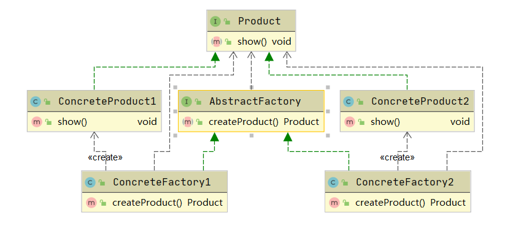
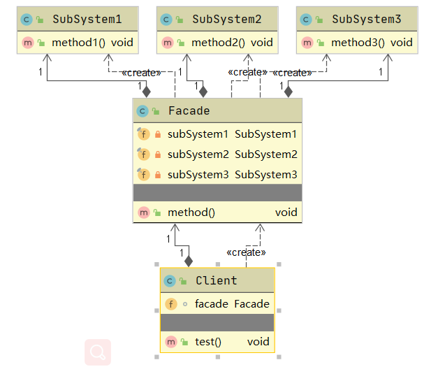

# 设计模式原则

## 开闭原则

对扩展开放，对修改关闭。当应用的需求改变时，在不修改软件实体的源代码或者二进制代码的前提下，可以扩展模块的功能，使其满足新的需求。

## 里式替换原则

## 依赖倒置原则

## 单一职责原则

## 接口隔离原则

## 迪米特法则

## 合成复用原则

---

# 23种设计模式

## 单例模式（singleton）

**定义**：指一个类只有一个实例，且该类能自行创建这个实力的一种模式。

**特点**：

1. 保障内存只有一个实例，减少内存开销
2. 全局访问，可以优化和共享资源

**demo**

1. 饿汉式

``` java
package com.huangjie.designmode.singleton;

/**
 * @author huangjie
 * @version 1.0
 * @description 饿汉式
 * @date 2021/7/13 10:39
 */
public class SingletonMode {
    /**
     * 类加载时创建对象
     */
    private static final SingletonMode INSTANCE = new SingletonMode();

    /**
     * 构造函数必须用private修饰，防止new
     */
    private SingletonMode(){

    }

    /**
     * 提供创建对象的方法
     */
    private static SingletonMode getInstance(){
        return INSTANCE;
    }
}

```

2. 双重校验

```java
package com.huangjie.designmode.singleton;

/**
 * @author huangjie
 * @version 1.0
 * @description 懒汉式  对象需要的时候进行创建
 * @date 2021/7/13 10:42
 */
public class SingletonDoubleCheck {
    /**
     * 用volatile修饰防止指令重拍
     */
    private static volatile SingletonDoubleCheck instance;

    /**
     * 构造函数必须用private修饰，防止new
     */
    private  SingletonDoubleCheck(){

    }

    /**
     * 提供创建对象的方法
     * 双重校验
     */
    private static SingletonDoubleCheck getInstance(){
        //第一次校验，可提前进行获取，如果已经创建成功直接进行返回
        if (instance==null) {
            synchronized(SingletonDoubleCheck.class){
                //第二次校验防止重复创建对象
                if (instance==null) {
                    return new SingletonDoubleCheck();
                }
            }
        }
        return instance;
    }
}

```

3. 枚举

```java
package com.huangjie.designmode.singleton;

/**
 * @author huangjie
 * @version 1.0
 * @description 最安全的单例模式 通过枚举的方式获取，枚举不提供构造方法，可防止对象反射的方式进行获取
 * @date 2021/7/13 10:53
 */
public enum  SingletonEnum {
    //单例对象
    INSTANCE;

    private static SingletonEnum getInstance(){
        return INSTANCE;
    }
}

```

## 策略模式(strategy)

**定义**：该模式定义了一系列算法，并将每个算法封装起来，是他们可以互相替换，其算法的变化不影响使用算法的客户。策略模式属于对象行为模式，它通过对算法的封装，把使用算法的责任和算法的实现分隔开，并委派给不同的对象对这些算法进行管理。

**特点**：避免重复代码，防止多个if...else语句，提供对开闭原则的支持，在在不修改源代码的情况下，灵活增加新的算法。可针对不同的场景，提供不同的策略支持。灵活可扩展。

**结构**：

1. 抽象策略接口：定义一个公共的方法，各种不同的具体策略实现自己的逻辑业务。策略管理上线文聚合该对象的集合map，管理不同的具体策略的注册和查找调用，该抽象策略可使用接口也可使用 抽象类。
2. 具体的策略类，实现策略接口，提供具体的实现。
3. 策略管理上下文，管理具体的策略。


**demo**:

```java
package com.huangjie.designmode.strategy;

/**
 * @author huangjie
 * @version 1.0
 * @description 抽象策略接口
 * @date 2021/7/13 11:28
 */
public interface StrategyService {
    /**
     * 抽象策略方法
     */
    void strategyMethod();
}

```

```java
package com.huangjie.designmode.strategy;

import java.util.HashMap;
import java.util.Map;

/**
 * @author huangjie
 * @version 1.0
 * @description 策略管理上下文
 * @date 2021/7/13 11:32
 */
public class StrategyContext {

    private final Map<String, StrategyService> strategyServiceMap = new HashMap<String, StrategyService>();

    public StrategyService getConcreteStrategy(String key) {
        return strategyServiceMap.get(key);
    }

    public void putConcreteStrategy(String key, StrategyService strategyService) {
        strategyServiceMap.put(key, strategyService);
    }

    public void removeConcreteStrategy(String key) {
        strategyServiceMap.remove(key);
    }

    public void strategyMethod(String key) {
        strategyServiceMap.get(key).strategyMethod();
    }

}

```

```java
package com.huangjie.designmode.strategy;

/**
 * @author huangjie
 * @version 1.0
 * @description
 * @date 2021/7/13 11:29
 */

public class ConcreteStrategyServiceA implements StrategyService{

    public void strategyMethod() {
        System.out.println("concrete strategy service a...");
    }
}

```

```java
package com.huangjie.designmode.strategy;

/**
 * @author huangjie
 * @version 1.0
 * @description
 * @date 2021/7/13 11:31
 */
public class ConcreteStrategyServiceB implements StrategyService{
    public void strategyMethod() {
        System.out.println("concrete strategy service b...");
    }
}

```

**函数式接口** 1.8基于函数式 接口实现策略模式，传入具体的lamda表达式（即不同的策略支持）

```java
package com.huangjie.designmode.strategy;

import java.util.function.Consumer;

/**
 * @author huangjie
 * @version 1.0
 * @description
 * @date 2021/7/13 12:32
 */
public interface StrategyServiceNew<T> {
    /**
     * 函数式策略
     * @param consumer 传入具体的函数式接口
     */
    void strategyMethod(Consumer<T> consumer);
}

```


## 工厂方法模式（factory）

**定义**：提供一个产生对象的方法，用户无需知道对象具体的创建细节。

**特点**：对象的使用和对象的创建分离



**demo**：

```java
package com.huangjie.designmode.factory;

/**
 * @author huangjie
 * @version 1.0
 * @description
 * @date 2021/7/13 13:40
 */
public interface  AbstractFactory {
    /**
     * 生成对象
     * @return 对象
     */
    Product createProduct();
}

```

```java
package com.huangjie.designmode.factory;

/**
 * @author huangjie
 * @version 1.0
 * @description
 * @date 2021/7/13 13:41
 */
public interface Product {
    /**
     * 产品
     */
    void show();
}

```

```java
package com.huangjie.designmode.factory;

/**
 * @author huangjie
 * @version 1.0
 * @description
 * @date 2021/7/13 13:42
 */
public class ConcreteFactory1 implements AbstractFactory{
    @Override
    public Product createProduct() {
        return new ConcreteProduct1();
    }
}

```

```java
package com.huangjie.designmode.factory;

/**
 * @author huangjie
 * @version 1.0
 * @description
 * @date 2021/7/13 13:47
 */
public class ConcreteFactory2 implements AbstractFactory{
    @Override
    public Product createProduct() {
        return new ConcreteProduct2();
    }

}

```

```java
package com.huangjie.designmode.factory;

/**
 * @author huangjie
 * @version 1.0
 * @description
 * @date 2021/7/13 13:43
 */
public class ConcreteProduct1 implements Product {
    public String value1;

    @Override
    public void show() {
        System.out.println("concrete product 1");
    }
}

```

```java
package com.huangjie.designmode.factory;

/**
 * @author huangjie
 * @version 1.0
 * @description
 * @date 2021/7/13 13:44
 */
public class ConcreteProduct2 implements Product{

    @Override
    public void show() {
        System.out.println("concrete product 2");
    }
}

```

## 门面模式(facade)

**定义**：对外提供统一的接口，屏蔽内部的具体实现细节。

**特点**：结构简单、包含对多个子系统的引用。



**demo**：

```java
package com.huangjie.designmode.facade;

/**
 * @author huangjie
 * @version 1.0
 * @description
 * @date 2021/7/13 13:56
 */
public class Facade {

    private final SubSystem1 subSystem1 = new SubSystem1();
    private final SubSystem2 subSystem2 = new SubSystem2();
    private final SubSystem3 subSystem3 = new SubSystem3();

    public void method() {
        subSystem1.method1();
        subSystem2.method2();
        subSystem3.method3();
    }
}

```


```java
package com.huangjie.designmode.facade;

/**
 * @author huangjie
 * @version 1.0
 * @description
 * @date 2021/7/13 13:56
 */
public class SubSystem1 {
    public void method1() {
        System.out.println("child system 1...");
    }
}

```


```java
package com.huangjie.designmode.facade;

/**
 * @author huangjie
 * @version 1.0
 * @description
 * @date 2021/7/13 13:56
 */
public class SubSystem2 {
    public void method2() {
        System.out.println("child system 2...");
    }
}

```

```java
package com.huangjie.designmode.facade;

/**
 * @author huangjie
 * @version 1.0
 * @description
 * @date 2021/7/13 13:56
 */
public class SubSystem3 {
    public void method3() {
        System.out.println("child system 3...");
    }
}

```

```java
package com.huangjie.designmode.facade;

/**
 * @author huangjie
 * @version 1.0
 * @description
 * @date 2021/7/13 13:59
 */
public class Client {
    Facade facade = new Facade();

    public void test() {
        facade.method();
    }
}

```


